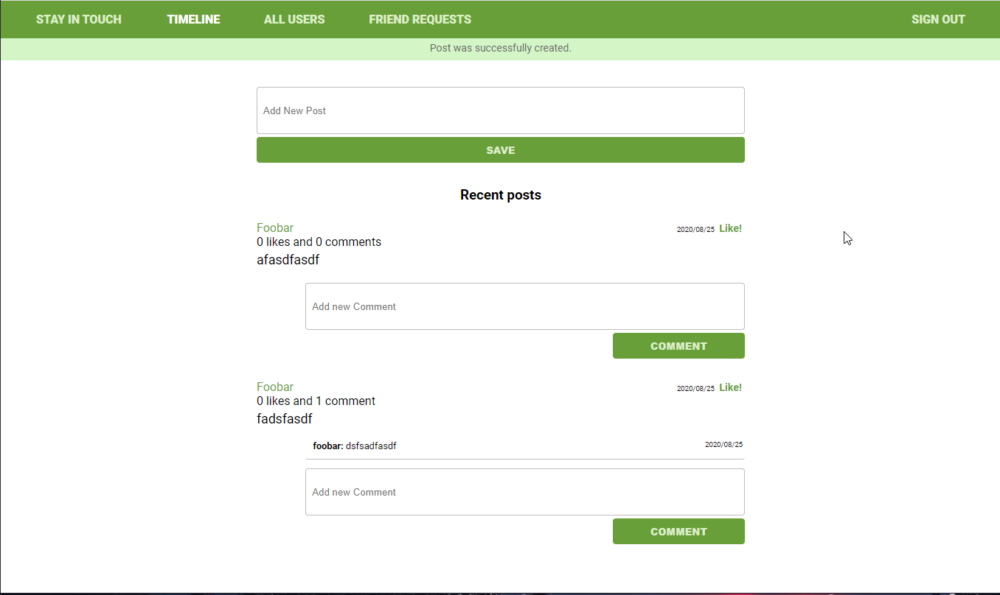

# Social Media App

## This application is supposed to be a facebook clone

## Features
- Registration & Login
- Ability to create posts, comments, and add likes
- Ability to add other users as friends

## [Live Demo](https://naked-social-scaffold.herokuapp.com/)

## [How to Run Locally & Run Rspec Tests](HOWTO.md) 

## Built With

- Ruby On Rails
- Neovim
- VSCode
- Rubocop
- Stylelint
- Github Actions
- Postgresql

## Authors

👤 **Hasan Kharouf**

- Github: [@WinterCore](https://github.com/wintercore)

👤 **Gerónimo Morisot**

- Github: [@Bismarck-GM](https://github.com/Bismarck-GM)
- Twitter: [@Rewritablee](https://twitter.com/Rewritablee)
- Linkedin: [geronimomorisot](https://linkedin.com/in/geronimomorisot)

## 🤝 Contributing

Contributions, issues and feature requests are welcome!

Feel free to check the [issues page](issues/).

## Acknowledgments

- Microverse
- [Shingi's Repo](https://github.com/simandebvu/Social-media-website)

## 📝 License

This project is [MIT](lic.url) licensed.